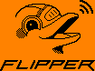

#  Awesome Tested Flipper Zero Project ! 

## Introduction
here is a list of my favorit flipper zero project. Do not forget [protection](https://www.printables.com/fr/model/204882-flipper-zero-case).
##  Favorites Projects 
#### BadUsb
[Flipper_Zero_Badusb_hack5_payloads](https://github.com/nocomp/Flipper_Zero_Badusb_hack5_payloads) - All hak5 payloads on Flipper Zero

[Mouse jiggler](https://github.com/MuddledBox/flipperzero-firmware/tree/Mouse_Jiggler/applications/mouse_jiggler) - Mouse jiggler to appear online
#### NFC
[FlipperAmiibo](https://github.com/Gioman101/FlipperAmiibo) - Amiibo emulation
#### SubGHz
[Tesla Charging Port](https://forum.flipperzero.one/t/tesla-hey-does-anyone-want-the-files-for-opening-tesla-charging-ports/6743) - File for the charging trap on Tesla
#### infrared
[Flipper-IRDB](https://github.com/Lucaslhm/Flipper-IRDB) - Infrared collection

[flipper-zero_bc_scanner_emulator](https://github.com/polarikus/flipper-zero_bc_scanner_emulator) - Bar code Scanner

### Cable Interface
[flipperzero-sentry-safe-plugin](https://github.com/H4ckd4ddy/flipperzero-sentry-safe-plugin) - Flipper zero exploiting vulnerability to open any Sentry Safe and Master Lock electronic safe without any pin code.

##  My projects and modified projects 
### Original

#### BadUsb
#### NFC
#### Infra-red
#### SubGHz

### Modified

#### BadUsb
#### NFC
#### Infra-red
#### SubGHz

##  Favorites Projects Dumps 

[Flipper](https://github.com/UberGuidoZ/Flipper) modded flipper projects of UberGuidoZ

[awesome-flipperzero](https://github.com/djsime1/awesome-flipperzero) Projects collection of djsime1

